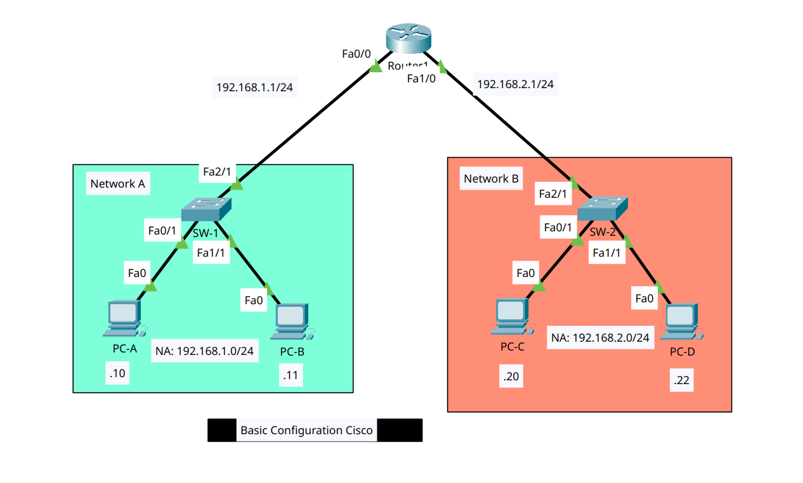

# Cisco Basic Configuration – Cisco Packet Tracer

## Project Description

This project demonstrates the basic configuration of Cisco networking devices using Cisco Packet Tracer.

The objective of this lab is to understand fundamental networking concepts, including:

* Router configuration
* Interface IP addressing
* End device configuration
* Default gateway configuration
* Network connectivity testing

The network consists of two different subnets connected through a single router, allowing devices from both networks to communicate with each other.

---

## Network Topology Design



### Network Segments

* Network A → 192.168.1.0/24
* Network B → 192.168.2.0/24

---

## IP Addressing Scheme

### Router-1

| Interface | IP Address  | Subnet Mask   |
| --------- | ----------- | ------------- |
| Fa0/0     | 192.168.1.1 | 255.255.255.0 |
| Fa1/0     | 192.168.2.1 | 255.255.255.0 |

### End Devices

| Device | IP Address   | Subnet Mask   | Default Gateway |
| ------ | ------------ | ------------- | --------------- |
| PC-A   | 192.168.1.10 | 255.255.255.0 | 192.168.1.1     |
| PC-B   | 192.168.1.11 | 255.255.255.0 | 192.168.1.1     |
| PC-C   | 192.168.2.20 | 255.255.255.0 | 192.168.2.1     |
| PC-D   | 192.168.2.22 | 255.255.255.0 | 192.168.2.1     |

---

## Router Configuration (Cisco CLI)

The following commands are used to configure Router-1 and enable communication between both networks.

### Configure Router Hostname

```bash
Router> enable
Router# configure terminal
Router(config)# hostname Router-1
Router(config)# exit
```

### Configure Enable Secret Password (Optional)

```
Router-1> enable
Router-1# configure terminal
Router-1(config)# enable secret admin123
Router-1(config)# exit
```

### Configure Interface FastEthernet 0/0

```
Router-1> enable
Router-1# configure terminal
Router-1(config)# interface fa0/0
Router-1(config-if)# ip address 192.168.1.1 255.255.255.0
Router-1(config-if)# no shutdown
Router-1(config-if)# exit
```

### Configure Interface FastEthernet 1/0

```
Router-1> enable
Router-1# configure terminal
Router-1(config)# interface fa1/0
Router-1(config-if)# ip address 192.168.2.1 255.255.255.0
Router-1(config-if)# no shutdown
Router-1(config-if)# exit
```

### Save Configuration

```
Router-1# copy running-config startup-config
```

---

## PC Configuration

### Network A

#### PC-A

```text
IP Address      : 192.168.1.10
Subnet Mask     : 255.255.255.0
Default Gateway : 192.168.1.1
```

#### PC-B

```text
IP Address      : 192.168.1.11
Subnet Mask     : 255.255.255.0
Default Gateway : 192.168.1.1
```

### Network B

#### PC-C

```text
IP Address      : 192.168.2.20
Subnet Mask     : 255.255.255.0
Default Gateway : 192.168.2.1
```

#### PC-D

```text
IP Address      : 192.168.2.22
Subnet Mask     : 255.255.255.0
Default Gateway : 192.168.2.1
```

---

## Verification and Testing

Verify interface status:

```bash
Router-1# show ip interface brief
```

Verify routing table:

```bash
Router-1# show ip route
```

Test connectivity between devices:

```bash
PC-A> ping 192.168.1.11
PC-A> ping 192.168.2.20
PC-A> ping 192.168.2.22
```

Expected Result:

```text
Success rate is 100 percent (5/5)
```

---

## Conclusion

This lab successfully demonstrates the basic configuration of a Cisco router connecting two different networks. After assigning IP addresses, configuring router interfaces, and setting default gateways on all end devices, hosts from different subnets can communicate successfully through Router-1.
